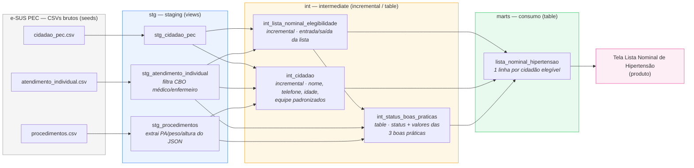

# 1. Diagrama da arquitetura do pipeline

**Camadas:**
- **stg**: 1 linha bruta por origem, tipagem e filtros mínimos (ex.: CBO já filtrado em `stg_atendimento_individual`).
- **int**: regras de negócio isoladas por responsabilidade — elegibilidade, limpeza de cidadão, status das boas práticas.
- **marts**: camada de consumo, junta o que as camadas anteriores calcularam.

## Schema da tabela final (`marts.lista_nominal_hipertensao`)

Granularidade: **1 linha por cidadão elegível para a lista** (`id_cidadao` é chave primária, `unique` + `not_null`).

| Coluna | Tipo | Descrição |
|---|---|---|
| `id_cidadao` | BIGINT | PK. Cidadão elegível (ver regra de elegibilidade abaixo). |
| `nome_cidadao` | VARCHAR | Nome padronizado em maiúsculas. Null em 9/312 casos (dado de origem vazio). |
| `cns` | VARCHAR | Cartão Nacional de Saúde. |
| `cpf` | VARCHAR | CPF. |
| `dt_nascimento` | DATE | Data de nascimento. |
| `idade` | BIGINT | Calculada vs. `data_referencia` (2026-08-01). |
| `telefone_celular` | VARCHAR | Validado/padronizado `(XX) XXXXX-XXXX`. |
| `ine_equipe` | VARCHAR | INE da equipe de vínculo (chave estável). |
| `nome_equipe` | VARCHAR | Nome da equipe, grafia padronizada "ESF N". |
| `microarea` | VARCHAR | Sempre null — nenhuma fonte bruta traz esse dado. |
| `status_consulta` | VARCHAR | `EM_DIA` / `ATRASADA` / `NUNCA_REALIZADA` (janela 6 meses). |
| `dt_ultima_consulta` | DATE | Data do atendimento mais recente. |
| `status_afericao_pa` | VARCHAR | Idem, janela 6 meses. |
| `dt_ultima_afericao_pa` | DATE | Data da última aferição de PA elegível. |
| `valor_ultima_afericao_pa` | VARCHAR | Ex. "150/70", extraído do JSON de origem. |
| `status_peso_altura` | VARCHAR | Idem, janela 12 meses. |
| `dt_ultima_peso_altura` | DATE | Data do último registro de peso/altura elegível. |
| `valor_ultimo_peso_kg` | DOUBLE | Redundância intencional (não exibida no protótipo). |
| `valor_ultima_altura_cm` | DOUBLE | Idem. |

## Onde cada regra de negócio é aplicada

| Regra | Camada / modelo | Por quê nessa camada |
|---|---|---|
| Filtro de CBO (médico/enfermeiro) em atendimentos | `stg_atendimento_individual` | É uma regra estrutural da fonte (quem pode registrar um atendimento válido), não de negócio da lista — faz sentido já na staging, pra todo consumidor dessa tabela herdar o filtro. |
| Entrada na lista (histórico de HIPERTENSÃO) e saída (óbito / condição resolvida) | `int_lista_nominal_elegibilidade` | Regra central do case, isolada num modelo próprio — reaproveitável por qualquer mart futura, sem precisar reprocessar a lógica de elegibilidade. |
| Limpeza/padronização de nome, telefone, idade e grafia de equipe | `int_cidadao` | Tratamento de qualidade de dado do cidadão, independente de elegibilidade — se um dia existir outra lista nominal (ex. diabetes), reaproveita este modelo sem duplicar a limpeza. |
| Status das 3 boas práticas (janelas de 6/12 meses, valores de PA/peso/altura) | `int_status_boas_praticas` | Regra de acompanhamento clínico, calculada só para quem já é elegível — mantém o cálculo fora da mart e fora da elegibilidade, que são responsabilidades diferentes. |
| Junção final e exposição das colunas da tela | `marts.lista_nominal_hipertensao` | Camada de consumo: só junta o que as camadas anteriores já calcularam, sem lógica de negócio própria. |
